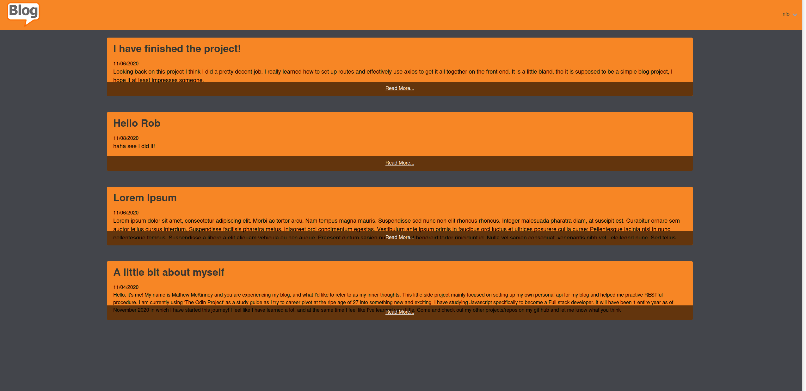

# My Blog API
This is a 3 part project for my personal blog. I started with an API to build up the back end of storing
and retrieving the data, then created seperate repos for the user interface, as well as an interface for the
actual blogger (me!). User interface allows users to view my content, as well as post comments on said contnent, no log in required.
The author portion allows me to view published and non-published posts, delete posts, edit posts, and delete user comments on posts.
This was a great project to continue hammering in good CRUD fundamentals as well as practicing Node.js, express and
MongoDB some more. Really fun creating my own API to pull data from instead of pulling it from someone else.


## Tech/framework used
NodeJs  
Express  
Mongoose/MongoDB  


## Hosted Demo
[The user interface hosted on Heroku](https://my-personal-blog-api.herokuapp.com/)!


## Associated Project Links
https://github.com/MMathew93/Blog-Project  
https://github.com/MMathew93/Blog-author  


## Demo



## Project setup
```
npm install
```

### Compiles and hot-reloads for development
```
npm run serve
```

### Compiles and minifies for production
```
npm run build
```

### Lints and fixes files
```
npm run lint
```

### Customize configuration
See [Configuration Reference](https://cli.vuejs.org/config/).